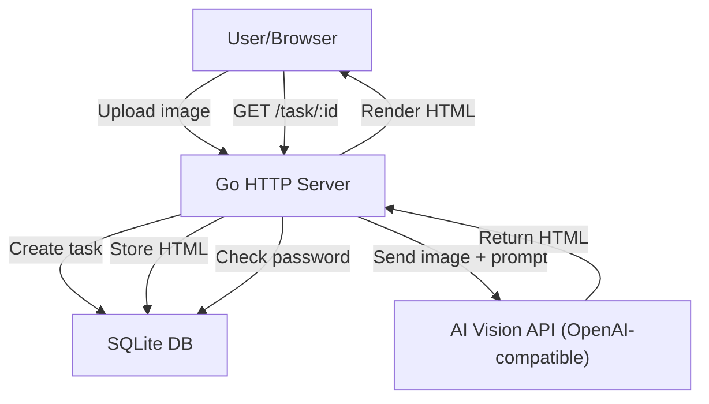

# Screenshot-to-HTML Generator (no-track-screenshot)

## Architecture Overview




## Project Structure

```
no-track-screenshot/
├── main.go                 # Entry point, server setup
├── config.go               # Config loading (YAML)
├── config.yaml             # Configuration file
├── prompt.txt              # Default AI prompt
├── handler.go              # HTTP handlers
├── ai.go                   # AI service client (OpenAI-compatible vision API)
├── db.go                   # SQLite database operations
├── model.go                # Data models (Task)
├── go.mod / go.sum
├── templates/
│   ├── index.html          # Upload page
│   ├── task.html           # Task result page (renders generated HTML)
│   └── password.html       # Password input page
└── static/
    └── style.css           # Basic styles
```

## Key Design Decisions

### Configuration (`config.yaml`)

```yaml
server:
  port: 8080
password: "your-access-password"
ai:
  endpoint: "https://api.openai.com/v1/chat/completions"
  key: "sk-xxx"
  model: "gpt-4o"
```

- YAML format for readability
- Single global password for general access, plus per-task one-time passwords

### Database Schema (SQLite)

**tasks** table:

- `id` TEXT PRIMARY KEY (nanoid/short UUID)
- `status` TEXT ("pending", "processing", "done", "failed")
- `html` TEXT (generated HTML content)
- `preview` BLOB (32x32 compressed JPEG of original image)
- `one_time_password` TEXT (nullable, per-task password)
- `one_time_password_used` INTEGER (0/1, whether the one-time password has been consumed)
- `error` TEXT (error message if failed)
- `created_at` DATETIME
- `updated_at` DATETIME

No separate image storage -- the original image is only held in memory long enough to: (1) generate the 32x32 preview, (2) base64-encode and send to the AI API.

### Prompt (`prompt.txt`)

Default content:

```
保留这张图的文字和emoji表情、整体结构、整体设计风格、颜色和背景色，生成一个html；不要对原图做部分截取、保留、特别是头像、logo等，可以使用占位符；直接输出可以使用的html代码。
```

### API Endpoints


| Method | Path                | Description                                               |
| ------ | ------------------- | --------------------------------------------------------- |
| GET    | `/`                 | Upload page (requires global password via cookie/session) |
| POST   | `/upload`           | Accept image, create task, return task ID                 |
| GET    | `/task/:id`         | View generated HTML (requires password)                   |
| POST   | `/task/:id/auth`    | Submit password for task access                           |
| GET    | `/task/:id/status`  | Poll task status (JSON)                                   |
| GET    | `/task/:id/preview` | Serve 32x32 preview image                                 |


### Core Flow

1. **Upload**: User uploads an image via the web UI
2. **Process**: Server creates a task in SQLite with status "pending", generates a 32x32 preview from the original image (stored as BLOB), base64-encodes the full image, and starts a goroutine to call the AI API
3. **AI Call**: Send the image + prompt to the OpenAI-compatible vision API using the Chat Completions endpoint with `image_url` content type (base64 data URL). Parse the response to extract the HTML code block
4. **Store**: Save the generated HTML to the task record, update status to "done"
5. **View**: User accesses `/task/:id`, authenticates with either the global password or a one-time task password, and sees the rendered HTML with a 32x32 preview thumbnail in the top-left corner

### Access Control

- The upload page requires the global password (stored in a session cookie after first auth)
- Each task page can be accessed with:
  - The global password (from config), OR
  - A per-task one-time password (set when creating the task, consumed on first use)
- Password check is done via a simple form POST, setting a cookie on success

### AI Service Client (`ai.go`)

- Uses standard `net/http` to call the OpenAI-compatible Chat Completions API
- Sends the image as a base64 data URL in the `image_url` content part
- Extracts HTML from the response (handles markdown code fences if present)
- Configurable endpoint/key/model to support OpenAI, Azure, or any compatible provider

### Image Handling

- Use Go's `image` package + `golang.org/x/image/draw` for resizing to 32x32
- Encode preview as JPEG with low quality for minimal storage
- Original image is never written to disk (only held in memory)

### Dependencies

- `github.com/mattn/go-sqlite3` - SQLite driver
- `gopkg.in/yaml.v3` - YAML config parsing
- `github.com/gorilla/mux` (or `net/http` with Go 1.22+ routing) - HTTP routing
- `github.com/matoous/go-nanoid/v2` - Short ID generation
- Standard library for image processing, HTTP client, templates

### UI Design

- **Upload page**: Clean, minimal design with drag-and-drop upload area, optional one-time password field
- **Task page**: Full-page rendered HTML with a fixed 32x32 preview thumbnail in the top-left corner (slightly transparent, showing the original screenshot for reference)
- **Password page**: Simple centered form for entering the access password

